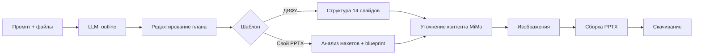

# AIDeck

Веб-приложение для генерации презентаций PowerPoint с помощью искусственного интеллекта. Пользователь описывает тему, прикладывает исходные материалы (Word, PDF, Markdown, TXT), выбирает шаблон оформления — система строит план слайдов, позволяет его отредактировать и собирает готовый `.pptx`.

## Возможности

- **Генерация по описанию и материалам** — до 5 файлов-источников, до 10 слайдов в презентации
- **Редактирование плана** — outline в формате Markdown перед финальной сборкой
- **Шаблоны оформления**
  - встроенный шаблон **ДВФУ** (14 слайдов с фиксированной структурой)
  - загрузка собственных шаблонов `.pptx` / `.pdf` (до 25 МБ, лимит на пользователя настраивается)
  - публичный каталог шаблонов с рейтингами и скачиванием
- **Несколько LLM-агентов** с автоматическим fallback при сбоях:
  - **MiMo** (Xiaomi MiMo) — основной агент по умолчанию
  - **Ollama** — локальные модели (например, `llama3.2`)
  - **Polza** — облачный Gemini через polza.ai (чат и генерация изображений)
- **Изображения на слайдах** — из материалов пользователя или AI-генерация (лимит настраивается)
- **Аутентификация** — регистрация с подтверждением email, JWT, сброс пароля, профиль с аватаром
- **Личный кабинет** — список готовых презентаций, скачивание, переименование, удаление

## Стек технологий

| Слой | Технологии |
|------|------------|
| Frontend | Next.js 16, React 19, TypeScript, Tailwind CSS 4, React Hook Form, Zod |
| Backend | FastAPI, SQLAlchemy 2, Pydantic Settings, python-pptx, PyMuPDF, python-docx |
| База данных | MySQL 8.4 |
| Инфраструктура | Docker Compose, uv (Python), phpMyAdmin |

## Архитектура

```
presentations_AI/
├── backend/          # FastAPI API и пайплайн сборки PPTX
├── frontend/         # Next.js SPA
├── database/init/    # SQL-схема при первом запуске MySQL
├── docker-compose.yml
└── .env.example      # переменные окружения
```

### Пайплайн генерации



**Этап 1 — создание (`POST /api/presentations/create`)**  
LLM формирует текстовый план (outline) на основе промпта, прикреплённых файлов и выбранного шаблона.

**Этап 2 — сборка (`POST /api/presentations/{id}/build`)**  
Фоновая задача FastAPI:

1. Обогащение контента из источников (для пользовательских шаблонов)
2. Планирование слайдов (семантические типы: title, cards, timeline, table, diagram и др.)
3. Анализ структуры пользовательского PPTX (template-driven pipeline)
4. Генерация / подстановка изображений
5. Заполнение шаблона и сохранение `.pptx` в БД

Статус сборки отслеживается через `GET /api/presentations/{id}` (`build_stage`: `queued`, `template_analysis`, `blueprint`, `images`, `pptx_fill`, …).

## Быстрый старт (Docker)

### Требования

- Docker и Docker Compose
- API-ключ хотя бы одного LLM-провайдера (рекомендуется MiMo или Polza)

### 1. Настройка окружения

```bash
cp .env.example .env
```

Заполните обязательные переменные в `.env`:

```env
MYSQL_ROOT_PASSWORD=...
MYSQL_DATABASE=presentations_ai
MYSQL_USER=...
MYSQL_PASSWORD=...

JWT_SECRET_KEY=...          # случайная строка для production

MIMI_API_KEY=...            # или POLZA_API_KEY, или Ollama локально

SMTP_USER=...               # для отправки кодов регистрации
SMTP_PASSWORD=...
SMTP_FROM=...
EMAIL_DEV_MODE=false        # true — коды в логах backend, без SMTP
```

### 2. Запуск

```bash
docker compose up --build
```

| Сервис | URL |
|--------|-----|
| Frontend | http://localhost:3000 |
| Backend API | http://localhost:8000 |
| Swagger / OpenAPI | http://localhost:8000/docs |
| phpMyAdmin | http://localhost:8080 |

Health-check backend: `GET /health`.

### Полезные команды Docker

```bash
# Только база данных
docker compose up mysql phpmyadmin

# Сброс кэша Next.js (если правки frontend не видны)
docker compose down
docker volume rm presentations_ai_frontend_next
docker compose up --build

# Production-сборка frontend
FRONTEND_TARGET=runner docker compose up --build
```

На Windows с Docker для hot reload frontend включён polling (`WATCHPACK_POLLING`, `CHOKIDAR_USEPOLLING`).

## Локальная разработка без Docker

### Backend

```bash
cd backend
uv sync
cp ../.env .env   # или симлинк
uv run uvicorn app.main:app --reload --port 8000
```

Python ≥ 3.9. Зависимости описаны в `backend/pyproject.toml`.

### Frontend

```bash
cd frontend
npm install
# NEXT_PUBLIC_API_URL=http://localhost:8000
npm run dev
```

### MySQL

Поднимите MySQL локально и выполните скрипты из `database/init/` в порядке нумерации, либо используйте только контейнер `mysql` из Compose.

## API (основные эндпоинты)

Все маршруты презентаций и шаблонов требуют JWT (`Authorization: Bearer …`).

### Auth — `/api/auth`

| Метод | Путь | Описание |
|-------|------|----------|
| POST | `/register/request` | Запрос кода регистрации |
| POST | `/register/verify` | Подтверждение и выдача токенов |
| POST | `/login` | Вход |
| POST | `/refresh` | Обновление access token |
| GET | `/me` | Текущий пользователь |
| POST | `/password-reset/request` | Сброс пароля |

### Presentations — `/api/presentations`

| Метод | Путь | Описание |
|-------|------|----------|
| GET | `/` | Список готовых презентаций |
| POST | `/create` | Создание outline (multipart: prompt, agent_id, template_id, source_files) |
| PATCH | `/{id}/outline` | Редактирование плана |
| POST | `/{id}/build` | Запуск сборки PPTX |
| GET | `/{id}` | Статус и метаданные |
| GET | `/{id}/download` | Скачивание `.pptx` |

### Templates — `/api/templates`

| Метод | Путь | Описание |
|-------|------|----------|
| GET | `/` | Шаблоны пользователя |
| GET | `/public` | Публичный каталог |
| POST | `/upload` | Загрузка шаблона |
| GET | `/{id}/preview` | Превью |
| POST | `/{id}/rating` | Оценка (1–5) |

### Agents — `/api/agents`

| Метод | Путь | Описание |
|-------|------|----------|
| GET | `/` | Список агентов и их доступность |
| POST | `/chat` | Тестовый чат с агентом |

## Конфигурация

Полный список переменных — в [`.env.example`](.env.example). Ключевые параметры генерации:

| Переменная | По умолчанию | Назначение |
|------------|--------------|------------|
| `PRESENTATION_DEFAULT_AGENT` | `mimo` | Агент для outline и контента |
| `PRESENTATION_MAX_SLIDES` | `10` | Лимит слайдов |
| `PRESENTATION_MAX_GENERATED_IMAGES` | `2` | Лимит AI-картинок за сборку |
| `PRESENTATION_LLM_FALLBACK_AGENTS` | `mimo,ollama` | Порядок fallback при 502/503/429 |
| `PRESENTATION_CRITICAL_FALLBACK_AGENT` | `polza` | Последний резервный агент |
| `PRESENTATION_TEMPLATE_AI_ANALYSIS` | `true` | AI-анализ стиля шаблона (Polza) |
| `PRESENTATION_USE_TEMPLATE_DRIVEN` | `true` | Pipeline для пользовательских PPTX |
| `OLLAMA_BASE_URL` | `http://host.docker.internal:11434` | URL Ollama с хоста в Docker |

## Структура backend

```
backend/app/
├── main.py                 # точка входа FastAPI
├── config.py               # Settings из .env
├── routers/                # auth, presentations, templates, agents
├── models/                 # SQLAlchemy-модели
├── schemas/                # Pydantic-схемы API
├── ai/
│   ├── registry.py         # выбор агента и resilient fallback
│   └── providers/          # mimo, ollama, polza_chat, polza_image
├── services/
│   ├── presentation_service.py      # создание outline
│   ├── presentation_build_service.py # фоновая сборка PPTX
│   ├── dvfu_generator.py            # шаблон ДВФУ (14 слайдов)
│   ├── template_driven/             # анализ и заполнение user PPTX
│   ├── slide_templates/             # рендер типов слайдов
│   ├── slide_renderers/             # низкоуровневая отрисовка в pptx
│   └── presentation_gamma/          # парсинг outline
└── assets/
    ├── dvfu_template.pptx
    └── system_template.pptx
```

## Структура frontend

```
frontend/
├── app/                    # App Router: /, /login, /register, /dashboard, /templates, /profile
├── components/
│   ├── auth/               # формы входа и регистрации
│   ├── dashboard/          # создание презентаций, редактор плана
│   └── templates/          # каталог шаблонов
└── lib/
    ├── api/                # клиенты REST API
    ├── auth/               # JWT в cookies / session
    └── outline/            # парсинг Markdown-плана
```

## База данных

Схема создаётся автоматически при первом запуске контейнера MySQL:

- `users`, `pending_registrations`, `verification_codes` — аутентификация
- `user_templates`, `template_ratings` — шаблоны и рейтинги
- `presentations`, `presentation_source_files` — презентации и исходники

Дополнительные миграции при старте backend: `ensure_user_profile_columns`, `ensure_template_catalog_schema`.

## Поддерживаемые форматы

**Исходные материалы:** `.docx`, `.pdf`, `.md`, `.markdown`, `.txt` 

**Шаблоны:** `.pptx`, `.pdf`

**Результат:** `.pptx` 


